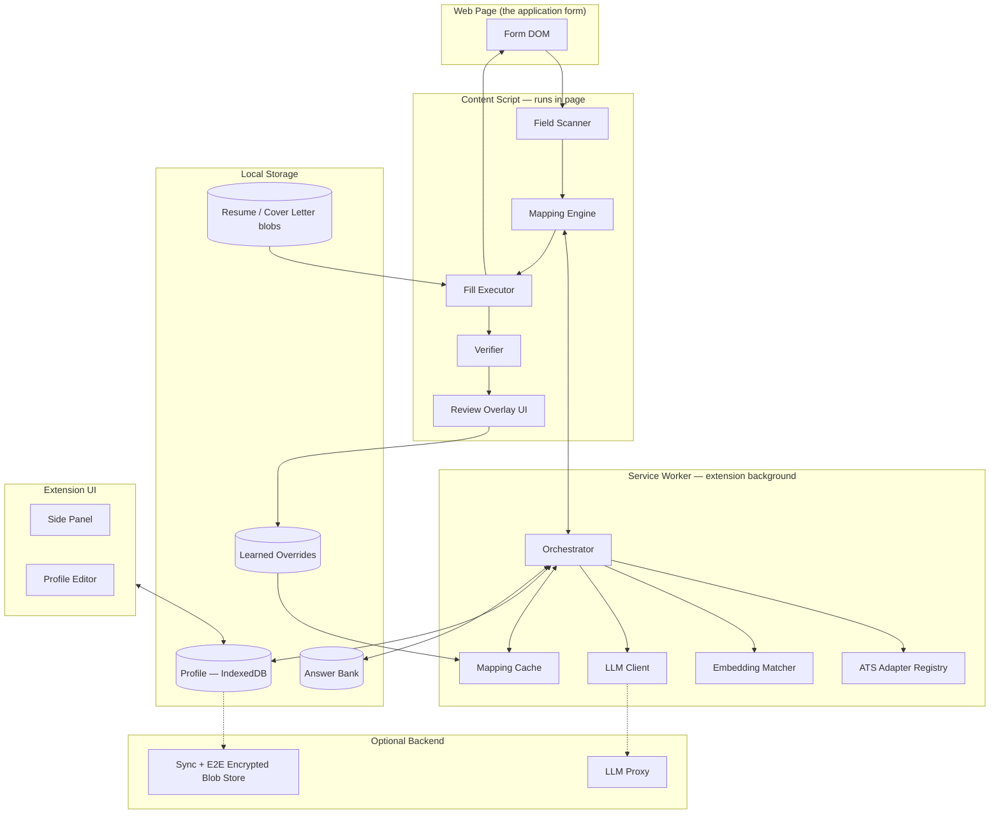

# AutoFill — Job Application Autofill
## End-to-End Architecture

**Version:** 1.0
**Date:** 2026-08-11
**Status:** Design — not yet implemented

---

## 1. What this is

A browser extension that fills job application forms from a profile you maintain once.

You click "Fill" on a Greenhouse / Lever / Workday / Ashby application. It detects every field, maps each one to your data, fills it, and shows you what it filled and what it could not. You review, fix anything wrong, and submit yourself.

### Goals

| # | Goal |
|---|------|
| G1 | Fill 90%+ of fields on the top 6 ATS platforms with zero manual typing |
| G2 | Handle unknown/custom forms gracefully — degrade, never break the page |
| G3 | Answer free-text questions ("Why this company?") with drafts you approve |
| G4 | Learn from corrections — fixing a field once fixes it forever on that site |
| G5 | Local-first. Profile data never leaves the device unless you turn on sync |

### Non-goals

- **Never auto-submits.** Human confirms every application. This is a hard rule, not a setting.
- Not a job scraper or auto-applier bot. It fills forms you opened.
- No CAPTCHA solving, no bot-detection evasion.
- v1 is browser-only. No mobile, no desktop agent.

---

## 2. System overview



### The one-sentence flow

Scan the DOM → describe each field → map descriptors to profile keys through a 4-tier cascade → fill with framework-safe writes → verify what actually landed → show a review overlay → record corrections.

---

## 3. Components

### 3.1 Field Scanner (content script)

Walks the DOM and emits a `FieldDescriptor` per input.

**Traversal must handle:**
- Shadow DOM — recurse into every `shadowRoot` (Workday, Salesforce widgets)
- Same-origin iframes — inject and recurse; cross-origin iframes get flagged "cannot fill"
- Lazy content — `MutationObserver` re-scans on subtree changes, debounced 300ms
- Multi-step wizards — re-scan on step change, keep a per-page session

**Label resolution, in priority order:**

1. `<label for="id">` text
2. Ancestor `<label>` text
3. `aria-labelledby` → resolved element text
4. `aria-label`
5. Nearest preceding text node within the field's container (walk up max 3 levels)
6. `placeholder`
7. Humanized `name` / `id` attribute (`first_name` → "first name")

All signals concatenate into a normalized `labelBlob` — lowercased, punctuation stripped, `*` and "(required)" removed. The blob is what the matcher sees.

```ts
interface FieldDescriptor {
  id: string;              // stable hash of the field
  el: WeakRef<Element>;
  kind: 'text' | 'email' | 'tel' | 'date' | 'number' | 'textarea'
      | 'select' | 'radio-group' | 'checkbox' | 'file' | 'combobox';
  labelBlob: string;       // normalized concatenation of all label signals
  autocomplete?: string;   // the browser autocomplete attribute, if honest
  name?: string;
  required: boolean;
  maxLength?: number;
  options?: { value: string; text: string }[];  // select / radio / combobox
  sectionHeading?: string; // nearest <h*> or fieldset legend above
  frameworkHint?: 'react' | 'vue' | 'angular' | 'plain';
  signature: string;       // hash(tagName + type + name + labelBlob) — cache key
}
```

`signature` is the cache key. It is stable across page loads and independent of DOM position, so a learned mapping survives site redesigns that keep field names.

---

### 3.2 Mapping Engine — the 4-tier cascade

Each tier is cheaper and more certain than the next. A field exits the cascade at the first tier that clears its confidence bar.

| Tier | Method | Latency | Confidence | Covers |
|------|--------|---------|-----------|--------|
| **0** | Learned override / ATS adapter | ~0ms | 1.00 | Known sites + anything you corrected before |
| **1** | Deterministic rules | ~0ms | 0.95 | `autocomplete` attr, regex on labelBlob |
| **2** | Local embeddings | ~50ms | 0.60–0.90 | Reworded standard fields |
| **3** | LLM batch call | ~2s | varies | Genuinely novel / company-specific |

**Tier 0 — Overrides & adapters.** Exact `signature` → `canonicalKey` lookups. Two sources: hand-written ATS adapters shipped with the extension, and overrides the user created by correcting a fill. User overrides win ties.

**Tier 1 — Rules.** A rule table of ~120 entries. `autocomplete="family-name"` → `personal.lastName`. Regex `/\b(linked ?in)\b/` → `links.linkedin`. Ordered, first match wins. Negative patterns prevent classic misfires: `/\bcompany\b/` must not hit `personal.lastName` on "Company Name".

**Tier 2 — Embeddings.** A quantized MiniLM (~23MB) runs in the service worker via `transformers.js`. Canonical field labels are embedded once at install and cached. Cosine-match the `labelBlob` against them.

- score ≥ 0.82 → accept
- 0.60–0.82 → accept but mark **low confidence**, highlight amber in the overlay
- < 0.60 → fall through to Tier 3

**Tier 3 — LLM.** All remaining unknown fields batch into **one** call. Input: field descriptors (labels + options only — never profile values), the canonical key list, and the page's job title/company. Output: strict JSON `{ fieldId, canonicalKey | "FREE_TEXT" | "UNMAPPABLE", confidence }`, validated with Zod. Result is written to the mapping cache keyed by `hash(hostname + signature)` so the call happens once per site, not once per application.

**Free-text questions** (Tier 3 returns `FREE_TEXT`) route to the Answer Generator (§3.6) instead of the profile.

---

### 3.3 Fill Executor — where naive implementations die

Setting `el.value = x` does not work on React. React tracks the last value it set; a direct assignment is invisible to it, so the field visually fills and then reverts on the next render, or submits empty. This is the single most common failure of homegrown autofillers.

**Text inputs — the native setter path:**

```ts
function setNativeValue(el: HTMLInputElement | HTMLTextAreaElement, value: string) {
  const proto = el instanceof HTMLTextAreaElement
    ? HTMLTextAreaElement.prototype
    : HTMLInputElement.prototype;
  const setter = Object.getOwnPropertyDescriptor(proto, 'value')!.set!;
  setter.call(el, value);                                  // bypasses React's tracker
  el.dispatchEvent(new Event('input',  { bubbles: true })); // React onChange
  el.dispatchEvent(new Event('change', { bubbles: true })); // Vue / Angular / plain
}
```

Wrap with `focus()` before and `blur()` after — many forms validate on blur and stay red otherwise.

**Per-kind strategy:**

| Kind | Strategy |
|------|----------|
| `select` | Match option by exact value → exact text → normalized text → fuzzy (Levenshtein ≤ 2). Set `selectedIndex`, dispatch `change`. |
| `checkbox` / `radio` | `el.click()`. Never `el.checked = true` — that skips the framework's handler. |
| `combobox` | Click trigger → wait for listbox via `MutationObserver` (2s timeout) → type to filter → click matching option. Per-ATS variants live in adapters. |
| `file` | Build `File` from the IndexedDB blob, attach via `DataTransfer`, assign to `el.files`, dispatch `change`. |
| `date` | Normalize to the field's format — sniff from `placeholder`, `min`/`max`, or locale. Fall back to `YYYY-MM-DD`. |
| `textarea` | Native setter + a synthetic keystroke burst if a character counter is present. |

**Pacing.** Fill sequentially with 30–80ms jitter between fields. Instantaneous parallel fills break autocomplete widgets and trip naive bot heuristics. Total time for a 40-field form: roughly 2–4 seconds.

**Repeating sections** (work history, education). Adapters declare an "add another" button selector. The executor clicks it *n−1* times, waits for the new row to mount, re-scans, then fills row by row. Rows are matched by DOM order against the profile array.

---

### 3.4 Verifier

After filling, re-read every field and compare against intent. Classify each into:

- ✅ **filled** — value matches
- ⚠️ **low confidence** — filled, but the mapping scored below threshold
- ❌ **rejected** — written, then reverted or cleared by the page (framework fight, or validation)
- ⬜ **skipped** — no mapping, or no profile data for the mapped key

This is what makes the tool trustworthy. Silent partial fills are worse than no fill, because you submit an application with a blank required field and never learn why.

---

### 3.5 Review Overlay

A shadow-DOM panel (isolated so page CSS cannot touch it) pinned bottom-right.

```
┌──────────────────────────────────────┐
│  AutoFill — Stripe · Greenhouse      │
│  ✅ 31 filled  ⚠️ 3 check  ⬜ 4 skip │
├──────────────────────────────────────┤
│  ⚠️  "Preferred pronouns"            │
│      → they/them          [✓] [edit] │
│  ⚠️  "Years with Kubernetes"         │
│      → 4                  [✓] [edit] │
│  ⬜  "How did you hear about us?"    │
│      [ pick a field ▾ ]              │
├──────────────────────────────────────┤
│  Never auto-submits. Review & submit.│
└──────────────────────────────────────┘
```

Clicking a row scrolls to and outlines the field. Editing a row writes a **learned override** — `(hostname, signature) → canonicalKey` at confidence 1.00. Next application on that site, Tier 0 catches it instantly.

---

### 3.6 Answer Generator (free-text questions)

Handles "Why do you want to work here?", "Describe a challenging project", "Salary expectations".

```
question ──► normalize + hash ──► Answer Bank hit? ──yes──► reuse (0ms, free)
                                        │no
                                        ▼
                          build context: profile + resume text
                                 + job description scraped from page
                                 + your top-3 similar past answers
                                        ▼
                                   LLM draft
                                        ▼
                          user reviews in overlay ──► approve
                                        ▼
                               store in Answer Bank
```

**Design decisions:**
- Drafts are **never** filled silently. They land in the overlay marked ⚠️ and require one click to accept.
- Answers cap at the field's `maxLength`, enforced in the prompt *and* truncated after.
- Company-specific answers store with the company as part of the key. Generic ones ("describe a challenge") reuse everywhere.
- Model: the **drafting** role. Which model that is depends on the configured provider (§7) — `claude-sonnet-5` on Anthropic, a free model on OpenRouter. Field mapping uses the **mapping** role, which is a classification task and does not need the bigger model.

---

### 3.7 Email Apply (postings with no form)

Plenty of postings have no application form at all. The whole process is a paragraph ending "send your CV to careers@…", and for those pages the scanner correctly reported that there was nothing to fill — which is accurate and useless.

```
scan finds no fillable fields ──► look for an address on the page
                                        │none
                                        ├──────────► say so, change nothing
                                        ▼
                        rank candidates: mailto in the job body
                                       > careers@ in the footer
                                       > drop privacy@ / support@ / no-reply@
                                        ▼
                        draft subject + body (drafting role)
                          from profile + resume + scraped posting
                                        ▼
                        review in the overlay — To, Subject, Body,
                          which documents to attach, all editable
                                        ▼
                        one click hands it to a compose window
                          mailto: · Gmail · clipboard
                                        ▼
                        audit row: drafted ──► sent
```

**Design decisions:**
- **Finding an address is easy; finding the right one is the job.** Every page has several — a privacy contact, a support desk, an unsubscribe link — and mailing a CV to a data-protection officer is worse than doing nothing. Candidates are ranked by *kind* (a `mailto:` link outranks an address in prose), by *region* (body copy outranks footer furniture), and by *local part* (careers@, jobs@, hr@ gain). Addresses that are definitionally not application inboxes are dropped, not demoted. The top candidate is a proposal: the runners-up travel with it and the panel lets the user pick.
- **The form wins.** A page with a real application form is applied to through the form. The email route is offered unasked only when the scan found no application fields; on a page that has both, it stays folded away.
- **Nothing sends.** There is no code path from this flow to a delivered email — the same architectural guarantee as §6.7's no-auto-submit. All three actions open a compose window that the user still has to press send in.
- **Attachments are named, not attached.** `mailto:` forbids attachments by design, Gmail's compose URL has no parameter for one, and the clipboard holds text. The panel says which file to attach and offers it as a one-click download. Pretending otherwise would produce applications sent without the CV they promise.
- **Recorded whether or not it goes out.** The audit row is written when the draft appears, as `drafted`, and promoted to `sent` on the send click. An email AutoFill composed and the user abandoned is exactly what the history exists to remember. "Sent" means a compose window opened holding the draft — AutoFill cannot watch a mail client, and claiming more would put an unverified assertion in the one view the user trusts.
- **Degrades to the address.** With AI assistance off, detection still runs (it is local and free) and the user gets a subject line, an empty body, and their own mail client. Turning the model off costs the wording, not the feature.
- **Same PII disclosure as §3.6.** The draft has to be about the applicant, so it sends profile and résumé text — under the same `llmEnabled` / API-key / host-permission gates, disclosed at the same place.

Lives in `core/email/detect.ts` (ranking), `core/email/send.ts` (compose-window URLs), `core/email/apply.ts` (worker-side orchestration), `llm/email-draft.ts` (the prompt).

---

## 4. Data model

### Canonical profile schema

The single vocabulary the whole system maps into. Zod-validated, versioned, migratable.

```ts
interface Profile {
  schemaVersion: number;

  personal: {
    firstName; middleName?; lastName; preferredName?;
    pronouns?; dateOfBirth?;
  };

  contact: {
    email; phone; phoneCountryCode;
    address: { line1; line2?; city; state; postalCode; country };
  };

  links: {
    linkedin?; github?; portfolio?; website?; twitter?; other?: string[];
  };

  work: Array<{
    company; title; location?; employmentType?;
    startDate; endDate?; current: boolean;
    description?; achievements?: string[];
  }>;

  education: Array<{
    school; degree; fieldOfStudy;
    startDate; endDate?; gpa?; honors?;
  }>;

  skills: string[];
  languages?: Array<{ name; proficiency }>;
  certifications?: Array<{ name; issuer; date; expiry?; credentialId? }>;

  workAuth: {
    authorizedIn: string[];        // ISO country codes
    requiresSponsorship: boolean;
    visaStatus?; needsRelocation?;
  };

  preferences: {
    desiredSalary?: { amount; currency; period: 'year' | 'hour' };
    noticePeriod?; earliestStartDate?;
    remotePreference?: 'remote' | 'hybrid' | 'onsite' | 'flexible';
    willingToRelocate?: boolean;
  };

  // Voluntary demographic fields. Every one defaults to "Decline to self-identify".
  eeo?: {
    gender?; race?; ethnicity?;
    veteranStatus?; disabilityStatus?;
  };

  documents: {
    resume: { blobId; filename; parsedText };
    coverLetter?: { blobId; filename };
    transcript?; portfolio?;
  };

  references?: Array<{ name; title; company; email; phone; relationship }>;
}
```

**EEO handling is deliberate.** These fields default to declining. They are only filled when the user explicitly sets them in the profile editor, and the editor states that every option including "decline" is legally valid. Guessing demographics from a name would be both wrong and offensive; the system never infers them.

### Storage layout

| Store | Backend | Contents |
|-------|---------|----------|
| `profile` | IndexedDB | The `Profile` object, encrypted at rest |
| `documents` | IndexedDB | Resume/cover-letter `Blob`s |
| `answerBank` | IndexedDB | `{ questionHash, question, answer, company?, usedCount, lastUsed }` |
| `mappingCache` | IndexedDB | `{ cacheKey, canonicalKey, confidence, source, createdAt }` |
| `overrides` | IndexedDB | `{ hostname, signature, canonicalKey }` — user corrections |
| `auditLog` | IndexedDB | One row per application. `kind: 'form' \| 'email'`; email rows carry `emailTo`, `emailStatus`, `sentAt` (§3.7) |
| `meta` | IndexedDB | Singletons: the vault record, the sync high-water mark, and the sealed `{ provider, apiKey, baseUrl? }` credential (§6.4) |
| `settings` | `chrome.storage.sync` | Non-sensitive prefs only: theme, enabled sites, LLM on/off, provider choice, model ids |

---

## 5. ATS adapters

Adapters are optional accelerators, not requirements. The generic pipeline works without them; adapters make known sites instant and correct.

```ts
interface AtsAdapter {
  name: string;
  matches(url: URL, doc: Document): boolean;
  fieldMap?: Record<string, CanonicalKey>;      // selector → key, Tier 0
  comboboxStrategy?: ComboboxStrategy;          // custom widget handling
  repeatingSections?: { container; addButton; rowSelector }[];
  multiStep?: { nextButton; stepIndicator };
  quirks?: string[];
}
```

**Ship with v1:**

| ATS | Difficulty | Notes |
|-----|-----------|-------|
| Greenhouse | Easy | Clean semantic HTML, stable `name` attributes |
| Lever | Easy | Predictable structure, honest `autocomplete` |
| Ashby | Medium | React, custom comboboxes |
| SmartRecruiters | Medium | Multi-step wizard |
| Workday | **Hard** | Nested shadow DOM, custom everything, aggressive re-render, per-tenant subdomains |
| iCIMS / Taleo | Hard | Legacy, iframe-heavy, frequent full-page postbacks |

Workday alone justifies the adapter layer. Treat it as its own milestone and budget accordingly — expect a week of iteration on its combobox and date widgets.

---

## 6. Privacy & security

Your profile is a complete identity dossier: name, address, phone, work history, sometimes DOB and demographics. Handle it accordingly.

1. **Local-first.** All profile data lives in IndexedDB on your machine. No backend is required for the core product to work.
2. **Encrypted at rest.** AES-GCM via WebCrypto; key derived from a user passphrase with PBKDF2 (600k iterations). Unlocked per browser session, held in service-worker memory only.
3. **PII never reaches the LLM for field mapping.** Tier 3 sends field *labels and options* — never values. The Answer Generator does send profile context, and that is disclosed explicitly at the point the feature is enabled, with a per-call toggle.
4. **Bring your own key, to whichever provider you like.** Requests go direct from the browser to the provider the user chose (§7), with no intermediary. The key is sealed with the DEK and records which vendor issued it, so switching providers asks for a new key rather than sending the old one somewhere it does not belong. Ollama needs no key at all and nothing leaves the machine. The hosted proxy is opt-in convenience, not the default.
5. **Least-privilege manifest.** `activeTab` + explicit host permissions for known ATS domains. No blanket `<all_urls>`.
6. **Zero-knowledge sync.** If sync is on, the backend stores a ciphertext blob it cannot decrypt. Keys never leave the client.
7. **No auto-submit.** Architectural, not configurable. The fill executor has no code path that clicks a submit button.
8. **Local audit log.** Every fill records site, timestamp, and field count. Viewable and clearable in the options page.

---

## 7. Tech stack

| Layer | Choice | Why |
|-------|--------|-----|
| Extension framework | **WXT** (Manifest V3) | HMR for content scripts, cross-browser build, TypeScript-native |
| Language | TypeScript, strict | Non-negotiable for a schema-heavy system |
| UI | React 19 + Tailwind | Options page, side panel, overlay |
| Validation | Zod | Profile schema, LLM response parsing, migrations |
| Storage | Dexie (IndexedDB) | Typed queries, migration support |
| Embeddings | `@xenova/transformers` — MiniLM-L6-v2 quantized | Runs offline in the worker, ~23MB, no network per field |
| Resume parsing | `pdfjs-dist` + LLM structuring | Extract text, then LLM → `Profile` fields |
| LLM | Pluggable provider layer — OpenRouter (default), Gemini, Groq, Ollama, Anthropic | Nothing should need a billing account to work; the default is a free model |
| Testing | Vitest + Playwright | Playwright drives real ATS demo forms |
| Backend (optional) | Hono on Cloudflare Workers + D1 | Small, cheap, edge; only sync + LLM proxy |

### The provider layer

Callers ask for a **role**, never a model id. There are three: `mapping` (Tier 3 classification), `drafting` (answers and application emails), `parsing` (résumé → profile). Each provider maps the three to its own defaults, and every one is overridable in the options page — free-tier model ids churn on a timescale of weeks, so a hardcoded list would be stale before anyone read it.

| Provider | Wire format | Key | Default models |
|----------|-------------|-----|----------------|
| **OpenRouter** *(default)* | OpenAI `chat/completions` | Bearer | a `:free` id for all three roles |
| Gemini | `:generateContent`, `x-goog-api-key` header | Header | `gemini-2.0-flash` / `gemini-2.5-flash` |
| Groq | OpenAI `chat/completions` | Bearer | `llama-3.1-8b-instant` / `llama-3.3-70b-versatile` |
| Ollama | native `/api/chat` on localhost | **none** | `llama3.2` |
| Anthropic | official SDK | Bearer | `claude-haiku-4-5` (mapping), `claude-sonnet-5` (drafts) |

- **One `complete({ system, messages, maxTokens, model, json? }) → { text }`.** Structured output is a JSON Schema, because one of the five speaks Zod and all five speak JSON Schema in some dialect. Validation stays with the caller: the schema constrains generation, it does not replace `safeParse`.
- **Plain `fetch` for everything but Anthropic.** Four vendor SDKs in a browser extension to send four nearly identical JSON bodies would be absurd. Anthropic keeps its SDK — it is already installed and carries the retry policy and the typed error classes.
- **One gate, in `llm/client.ts`.** Enabled, keyed, key-belongs-to-this-provider, host permission. `LlmDisabledError` names which one failed. `needsKey: false` is what keeps the no-key gate from firing on Ollama.
- **The host permission follows the base URL.** A self-hosted proxy needs its own grant, so the origin is computed from the URL that will actually be called — minus the port, which Chrome match patterns cannot express.

---

## 8. Repository layout

```
AutoFill/
├── docs/
│   ├── ARCHITECTURE.md            ← this file
│   ├── TRACKING.md                # application tracking subsystem
│   └── WORKFLOW.md                # runtime pipeline + development workflow
├── extension/
│   ├── wxt.config.ts
│   ├── entrypoints/
│   │   ├── background.ts          # service worker — orchestrator
│   │   ├── content.ts             # scanner + filler + overlay
│   │   ├── sidepanel/             # React: live fill status
│   │   └── options/               # React: profile editor
│   ├── src/
│   │   ├── core/
│   │   │   ├── scanner/           # DOM walk, label resolution, descriptors
│   │   │   ├── mapping/           # tiers 0-3, cascade orchestration
│   │   │   ├── filler/            # native setters, per-kind strategies
│   │   │   ├── verifier/          # post-fill diffing
│   │   │   ├── learning/          # override capture
│   │   │   └── email/             # address detection, compose-window URLs (§3.7)
│   │   ├── adapters/              # greenhouse.ts, lever.ts, workday.ts, ...
│   │   ├── schema/                # Zod profile, canonical keys, migrations
│   │   ├── storage/               # Dexie, crypto, blob store
│   │   ├── llm/                   # gates, prompts, response validation
│   │   │   └── providers/         # one module per vendor, one interface (§7)
│   │   └── ui/                    # shared components
│   └── tests/
│       ├── unit/
│       └── e2e/fixtures/          # saved HTML of real application forms
├── backend/                       # optional: sync + LLM proxy
└── README.md
```

---

## 9. Build order

Each milestone is independently useful. Ship M1 and the tool already saves you real time.

| M | Scope | Effort | Done when |
|---|-------|--------|-----------|
| **M0** | WXT skeleton, Zod schema, profile editor, encrypted IndexedDB | 3–4 days | You can enter and persist a full profile |
| **M1** | Scanner + Tier 0/1 mapping + fill executor + Greenhouse & Lever adapters | 1 week | A real Greenhouse application fills end to end |
| **M2** | Verifier, review overlay, learned overrides | 4–5 days | Correcting a field once makes it permanent |
| **M3** | Tier 2 embeddings + Tier 3 LLM mapping + cache | 4–5 days | An unseen custom form fills 80%+ |
| **M4** | Answer Bank + LLM drafts for free-text | 3–4 days | "Why this company?" produces an editable draft |
| **M5** | Workday, iCIMS, shadow DOM, multi-step wizards | 1–2 weeks | Workday fills without manual intervention |
| **M6** | Resume parsing → profile bootstrap; optional sync | 1 week | Upload a PDF, get a populated profile |

**Roughly 6–8 weeks solo at a steady pace.** M1 alone is about 10 days from an empty folder and is where the payoff starts.

---

## 10. Testing

**Unit** — label resolution against saved DOM snippets; rule table against a labeled corpus of ~500 real field labels; date/option normalization edge cases.

**Fixture-based integration** — save real application form HTML into `tests/e2e/fixtures/`, load in jsdom, assert the mapping output. This is the regression suite. Every bug found in the wild becomes a fixture.

**Playwright E2E** — drive the real Greenhouse/Lever demo boards. Assert the DOM after fill, not the intent. Catches framework-revert bugs, which unit tests structurally cannot.

**Accuracy tracking** — log per-site fill rate and correction rate locally. If a site's correction rate crosses 20%, its adapter needs work. This turns "does it work?" into a number.

---

## 11. Hard problems, named honestly

| Problem | Impact | Mitigation |
|---------|--------|-----------|
| React reverting programmatic writes | Fields silently empty on submit | Native setter + event dispatch (§3.3); the verifier catches whatever still fails |
| Workday's shadow DOM + custom widgets | Highest-volume ATS is the hardest | Dedicated adapter, its own milestone, budget a week of iteration |
| Ambiguous labels ("Name", "Location", "Date") | Wrong data in the wrong box | Section heading as disambiguating context; low-confidence flag rather than a confident guess |
| ATS redesigns break selectors | Adapters rot | Adapters are an optimization; the generic cascade is the floor. Never let an adapter be load-bearing |
| LLM mapping cost per application | Unit economics | Aggressive caching by `hash(hostname + signature)` — one call per *site*, not per application. Batch all unknowns into one request |
| Bot detection | Account risk | Human pacing, real events, no auto-submit. This is an assistive tool operating on a page the human opened |
| Profile drift | Stale applications | Prompt for a review after 90 days without an edit |

---

## 12. Decisions worth revisiting

Recorded so future-you knows these were choices, not accidents.

1. **Extension over desktop automation (Playwright/Selenium).** An extension shares the user's real session, needs no separate login, and cannot be mistaken for a headless bot. The cost is a harder DOM environment (shadow DOM, CSP). Worth it.
2. **Local embeddings over an API call per field.** 23MB of install weight buys offline operation, zero latency, and no per-field cost. The alternative bleeds money on every unknown form.
3. **Cascade over pure-LLM mapping.** An LLM could map every field. It would also cost more, take seconds, and be less deterministic than a regex that has been correct 10,000 times. Use the cheap tier when it is certain.
4. **Human-in-the-loop, permanently.** Auto-submit would make this an auto-applier. That is a different product with different ethics, different failure modes, and a real chance of sending a broken application to a job you wanted.

---

*End of document.*
