# AutoFill — Web App & Sync
## Companion design to [ARCHITECTURE.md](ARCHITECTURE.md) and [TRACKING.md](TRACKING.md)

**Version:** 1.0
**Date:** 2026-08-11
**Status:** Design — not yet implemented

`ARCH §n` → [ARCHITECTURE.md](ARCHITECTURE.md). `TRACK §n` → [TRACKING.md](TRACKING.md).

---

## 1. What changes, and what does not

You get a hosted web app at `app.autofill.dev` that shows your pipeline and lets you update it from any browser, including your phone. **The server never sees your data in a form it can read.**

### What does not change

- The extension remains the only thing that fills forms, captures postings, and detects submits. Those require running inside the page.
- The extension keeps working with the website switched off, offline, or deleted. Local-first is not weakened; the server is a replication target, not a source of truth.
- Your **profile** (ARCH §4) does not sync by default and the website never edits it. The dossier stays on your machine.

### What is new

| | |
|---|---|
| **One event log, two clients** | Extension and website are peers. Neither is authoritative. |
| **A sync service** | Stores encrypted event envelopes and immutable blobs. Cannot decrypt either. |
| **An account** | Needed to route your blobs to you. One passphrase derives both auth and encryption. |
| **A recovery kit** | Because there is no password reset when the server cannot decrypt. |

### The decision that makes this tractable

At 300 applications the entire tracker is **~3 MB** (TRACK §11.2). That is small enough to download whole, decrypt in the browser, and query locally. Which means zero-knowledge costs you a one-time 2-second first load and buys you a server that is worthless to an attacker.

If the dataset were 3 GB this design would not work and the honest answer would have been a server-readable database.

---

## 2. Architecture: one event log, two clients

The event log from TRACK §3.3 was chosen partly for this. An append-only log with UUIDv7 ids is a **grow-only set**: merge is union-then-dedup-by-id. Order-independent, no clock skew, no last-writer-wins, no conflict resolution to write or debug.

```mermaid
graph TB
    subgraph Ext["Extension (Chrome/Firefox, desktop)"]
        EFILL[Fill + Capture]
        EDB[(IndexedDB)]
        ESYNC[Sync client]
    end

    subgraph Web["Web app (any browser, incl. mobile)"]
        WUI[React SPA / PWA]
        WDB[(IndexedDB)]
        WSYNC[Sync client]
        WCRYPT[WebCrypto unlock]
    end

    subgraph API["Sync service — Cloudflare Workers"]
        AUTH[Auth]
        SYNCAPI["/sync push + pull"]
        BLOB["/blob by content hash"]
    end

    subgraph DB["Storage — opaque to server"]
        D1[(D1: encrypted events)]
        R2[(R2: encrypted blobs)]
    end

    EFILL --> EDB --> ESYNC
    ESYNC <-->|encrypted envelopes| SYNCAPI
    WSYNC <-->|encrypted envelopes| SYNCAPI
    WDB --> WSYNC
    WCRYPT --> WDB
    WUI --> WDB
    SYNCAPI --> D1
    BLOB --> R2
    ESYNC --> BLOB
    WSYNC --> BLOB
    AUTH -.session.-> SYNCAPI

    style D1 fill:#3b1f25,stroke:#a33
    style R2 fill:#3b1f25,stroke:#a33
```



### Everything is either an event or an immutable blob

This is the core simplification. There are no mutable documents to reconcile.

| Kind | Examples | Merge strategy |
|------|----------|----------------|
| **Events** — append-only, immutable | status changes, notes, contacts added, tags, priority, `compExpected` edits | Union by `id`. No conflicts possible. |
| **Blobs** — content-addressed, immutable | job postings, answer sets, resume files | Keyed by SHA-256 of plaintext. Written once. Same content → same key → idempotent. |

The `Application` row is **not synced**. It is a projection, rebuilt on each client by folding that client's copy of the event log. Two devices that have seen the same events compute the same row, byte for byte, because `deriveStatus` is a pure function (TRACK §3.4).

This means every mutable field must be expressed as an event. Editing a note appends an `application_patch` event carrying the new value; the projector takes the last one by `occurredAt`. Slightly more storage, zero merge logic.

> **The rule:** if two devices can change it, it is an event. If it is large and never changes, it is a blob. Nothing else syncs.

---

## 3. Cryptography

### 3.1 Key hierarchy

One passphrase, two derived keys, one random data key. This is the standard password-manager construction, and it exists so that changing your passphrase does not re-encrypt 300 applications.

```
                    passphrase
                        │
                 PBKDF2-SHA256
                 600,000 iters
                 salt = per-account, random, stored server-side
                        │
                   512 bits
              ┌─────────┴─────────┐
        bytes 0–31           bytes 32–63
              │                   │
      Master Unlock Key      Auth Key
         (never leaves        (sent to server;
          the device)          server stores
              │                scrypt hash of it)
              │
        unwraps ↓
              │
        Data Encryption Key  ← random 256-bit, generated once at signup
         (AES-GCM, never                 stored server-side ONLY as
          leaves the device)             wrappedDek = AES-GCM(MUK, DEK)
              │
        encrypts every event payload and every blob
```

**Why the indirection.** The DEK is what actually encrypts your data. The MUK only wraps it. Change your passphrase → derive a new MUK → re-wrap the same DEK → one row updated. Without this, a passphrase change would mean downloading, decrypting, re-encrypting and re-uploading everything.

**Why the auth key is derived, not chosen.** One secret to remember. The server receives the auth key (over TLS) and stores only a scrypt hash of it, exactly as it would a password — so a server breach yields a hash of a value that is itself the output of 600k PBKDF2 iterations. The MUK, which is the half that actually matters, is never transmitted in any form.

```ts
// packages/core/src/crypto/derive.ts — identical code in extension and web
export async function deriveKeys(passphrase: string, salt: Uint8Array) {
  const base = await crypto.subtle.importKey(
    'raw', new TextEncoder().encode(passphrase), 'PBKDF2', false, ['deriveBits']);

  const bits = new Uint8Array(await crypto.subtle.deriveBits(
    { name: 'PBKDF2', salt, iterations: 600_000, hash: 'SHA-256' }, base, 512));

  const muk = await crypto.subtle.importKey(
    'raw', bits.slice(0, 32), 'AES-KW', false, ['wrapKey', 'unwrapKey']);

  const authKey = bits.slice(32, 64);   // sent to the server, never stored locally

  return { muk, authKey };
}
```

Every envelope binds its context as AES-GCM `additionalData` — `af1:<kind>:<id>` — so a ciphertext lifted from one record cannot be replayed into another.

### 3.2 Unlock, and how long the key lives

| Surface | Key lifetime | Storage |
|---------|-------------|---------|
| Extension | Until browser close or explicit lock | Service-worker memory only (ARCH §6.2, unchanged) |
| Web — default | Until tab close | JS memory only |
| Web — "stay unlocked on this device" | 30 days | DEK wrapped by a **non-extractable** device key held in IndexedDB |

The device-key trick: generate a non-extractable AES-KW `CryptoKey` via `generateKey(..., extractable: false, ...)` and store the `CryptoKey` object itself in IndexedDB. It survives reloads, and JavaScript — including injected JavaScript — can use it but cannot read its bytes. Not a defense against a compromised page, which can simply ask it to unwrap. It is a defense against a stolen IndexedDB file.

**Never `localStorage`.** Never the passphrase itself, anywhere, ever.

### 3.3 Recovery — the part people get wrong

There is no password reset. The server cannot help you; that is the entire point.

At signup the browser generates a **Recovery Kit**: a printable page containing a 128-bit recovery code, rendered as 8 groups of 4 base32 characters. That code derives a second KEK which independently wraps the same DEK, stored server-side as `wrappedDekRecovery`.

```
┌────────────────────────────────────────────┐
│  AutoFill Recovery Kit                     │
│                                            │
│  Account:  you@example.com                 │
│  Created:  2026-08-11                      │
│                                            │
│  Recovery code:                            │
│    K7M2  9QXF  R4TP  8WBN                  │
│    3JHD  5VZC  6LYS  2EAG                  │
│                                            │
│  This is the ONLY way back in if you       │
│  forget your passphrase. We cannot reset   │
│  it. Print this. Do not store it in the    │
│  same password manager as your passphrase. │
└────────────────────────────────────────────┘
```

Signup does not complete until you confirm you have saved it. Onboarding friction here is correct friction — the alternative is a support ticket that has no possible resolution.

---

## 4. Sync protocol

Two endpoints and a watermark. That is the whole protocol.

### 4.1 Wire format

```ts
// What the server stores and can see
interface EventEnvelope {
  id: string;          // UUIDv7, client-generated — the dedup key
  userId: string;      // server-assigned
  seq: number;         // server-assigned, monotonic per user — the pull watermark
  deviceId: string;    // opaque, client-generated at install
  ciphertext: Uint8Array;  // AES-GCM(DEK, JSON(ApplicationEvent)), AAD = "af1:event:<id>"
  iv: Uint8Array;
  createdAt: string;   // server clock — used only for GC, never for ordering
}
```

**Ordering never uses `seq` or `createdAt`.** Both are server-assigned and reflect upload order, not reality. Ordering is `occurredAt` from inside the ciphertext, exactly as in TRACK §3.4. `seq` is purely a pull cursor.

### 4.2 The endpoints

```
POST /sync/push    { events: EventEnvelope[] }  → { assigned: {id, seq}[] , highWater }
GET  /sync/pull    ?since=<seq>&limit=500       → { events: EventEnvelope[], highWater, more }
PUT  /blob/:hash   <encrypted bytes>            → 201 | 204 (already present)
GET  /blob/:hash                                → encrypted bytes
```

Push is idempotent on `id` — re-pushing an event the server already holds returns its existing `seq`. A client that crashes mid-push simply pushes again.

Pull is a cursor walk. Each client persists its own `highWater`; there is no server-side per-device state to corrupt.

### 4.3 The loop

```ts
// packages/core/src/sync/loop.ts — shared by extension and web
async function syncOnce(db: Db, api: Api, dek: CryptoKey) {
  // 1. Push anything local the server has not acknowledged
  const pending = await db.events.where('syncedSeq').equals(-1).toArray();
  if (pending.length) {
    const envelopes = await Promise.all(pending.map(e => seal(dek, e)));
    const { assigned } = await api.push(envelopes);
    await db.transaction('rw', db.events, () =>
      Promise.all(assigned.map(a => db.events.update(a.id, { syncedSeq: a.seq }))));
  }

  // 2. Pull everything new
  let cursor = await db.meta.get('highWater');
  for (;;) {
    const { events, more, highWater } = await api.pull(cursor);
    const opened = await Promise.all(events.map(e => open(dek, e)));
    await db.events.bulkPut(opened);           // union by primary key — dedup is free
    cursor = highWater;
    await db.meta.put({ key: 'highWater', value: cursor });
    if (!more) break;
  }

  // 3. Rebuild projections only for applications whose events changed
  await reproject(db, affectedApplicationIds(opened));
}
```

**There is no conflict handler because there are no conflicts.** Two devices editing the same application's notes at the same moment produce two `application_patch` events; both survive in the log, the projector takes the later `occurredAt`, and both devices converge on the same answer. Nothing is lost and nothing needs a merge UI.

### 4.4 Cadence

| Client | Trigger |
|--------|---------|
| Extension | `chrome.alarms` every 15 min · immediately after any capture · on browser startup |
| Web | On load · on focus after >60s hidden · every 5 min while visible · immediately after any write |

Pull-only clients that have been offline for months just walk the cursor. There is no expiry and no forced full re-sync.

### 4.5 Deletion

Deleting is an event (`deleted`), not a row removal — otherwise a device that was offline would resurrect it on next push. The projector hides deleted applications; a nightly local job hard-deletes their blobs once every known device has passed that `seq`.

Server-side hard deletion happens only on account deletion, which drops the row and every blob in one transaction.

---

## 5. What syncs, and what deliberately does not

Reducing what leaves the machine is worth more than any amount of cryptographic cleverness.

| Data | Syncs? | Why |
|------|--------|-----|
| Application events (status, notes, tags, contacts) | ✅ Yes | This is the product |
| Job posting snapshots | ✅ Yes, blob | ~1.6 KB each, and re-reading the JD before an interview is a top mobile use case |
| Companies, aliases | ✅ Yes | Small, needed for display |
| **Profile** (ARCH §4) | ❌ **No** | The website does not edit it. Keeping the full identity dossier off the server entirely is free — take it. |
| **Answer sets** (what you submitted) | ⚠️ **Opt-in, default off** | Same PII as the profile, plus free-text. Useful pre-interview, so the option exists — but it is the single largest privacy exposure and should be a deliberate choice. |
| **Resume / cover letter files** | ⚠️ Opt-in, default off | 200 KB each; only needed if you want to download a resume on the go |
| **EEO answers** | ❌ **Never** | Not stored per-application at all (TRACK §3.1). Nothing to sync. |
| Mail OAuth tokens | ❌ **Never** | A token in a synced blob is a token on someone else's machine |
| Learned field overrides, mapping cache | ❌ No | Extension-local, worthless on the web, and they leak which sites you visited |

Default sync payload at 300 applications: **~1.5 MB of events + ~0.5 MB of postings.** Turning on answer sets roughly triples it and changes the threat conversation, which is exactly why it is a switch and not a default.

---

## 6. The web app

### 6.1 Surfaces

Same information architecture as TRACK §8, re-laid-out for a full viewport and for touch.

| Route | Purpose |
|-------|---------|
| `/` | Attention queue — what needs you today (TRACK §8.1). Identical ranking rules. |
| `/board` | The six live stages as columns. Drag to move → appends `status_corrected`. |
| `/app/:id` | Detail: timeline from the event log, the job description, notes, contacts. |
| `/insights` | Analytics (TRACK §10), including the n=20 gates. |
| `/settings` | Devices, sync status, passphrase change, export, account deletion. |

Mobile collapses `/board` to a stage-filtered list — horizontal drag-and-drop on a phone is a bad interaction and a worse one to build.

### 6.2 First load vs. every other load

```
FIRST LOAD (new device)                EVERY OTHER LOAD
─────────────────────────              ─────────────────────────
login          ~300 ms                 read IndexedDB      ~50 ms
enter passphrase                       render                ← INTERACTIVE
derive MUK     ~800 ms (600k PBKDF2)   pull delta      background
unwrap DEK       ~1 ms
pull ~2,700 events  ~1.2 s
decrypt + project   ~400 ms
                ─────────
                  ~2.7 s               ~150 ms
```

PBKDF2 at 600k iterations is deliberately ~800 ms and runs in a Web Worker so the UI thread never janks. Show real progress text — "unlocking", "syncing 2,700 events" — not a spinner. A spinner during a 3-second decrypt reads as broken.

After first load the app is fully local: IndexedDB holds the decrypted projection, and every query, filter and chart runs against it with no network in the path.

### 6.3 Search and analytics run client-side

The server cannot index ciphertext, so search is local — and at this size that is not a compromise.

- **Structured filters** (company, stage, date range, tag) hit Dexie indexes. Sub-millisecond.
- **Full-text over job descriptions** uses MiniSearch over the decrypted text, index built once on load. ~300 documents × 4.6 KB is a ~1.4 MB in-memory index, built in well under a second.
- **Analytics** fold the event log in memory. Two thousand events is nothing.

No server-side query means no query-pattern leakage either — the server cannot learn what you searched for, because it never sees a search.

### 6.4 Offline

The PWA service worker caches the app shell; IndexedDB holds the data. Offline you get full read access and full write access — writes queue as unsynced events and push when you reconnect. This falls out of the sync design rather than being built.

Installable on iOS and Android via the manifest. No app store, no native build.

---

## 7. Auth and sessions

```
POST /auth/signup   { email, authKey, salt, wrappedDek, wrappedDekRecovery }
POST /auth/login    { email, authKey }  → HttpOnly session cookie + { salt, wrappedDek }
POST /auth/rotate   { authKey_old, authKey_new, wrappedDek_new }
```

- Session cookie: `HttpOnly`, `Secure`, `SameSite=Strict`, 30-day sliding expiry, revocable per device from `/settings`.
- `salt` is fetched **before** login by email, which is an account-existence oracle. Mitigate by returning a deterministic fake salt derived from `HMAC(serverSecret, email)` for unknown accounts, so probing is uninformative.
- Rate limit login to 10 attempts per 15 minutes per IP and per account. The auth key is high-entropy, so this is belt-and-braces.
- Email is used for account identity and nothing else. No marketing, no email-based recovery — email cannot recover an account, only the Recovery Kit can.

**Optional passkey** (WebAuthn) as an alternative to typing the auth key half on a phone. It replaces the *server auth* step only. The passphrase is still required to derive the MUK, because a passkey cannot produce your decryption key. Being honest about this in the UI matters — "signed in" and "unlocked" are two different states and users will conflate them.

---

## 8. Backend

Deliberately small. It stores opaque bytes and hands them back.

| Layer | Choice | Notes |
|-------|--------|-------|
| Runtime | Hono on Cloudflare Workers | Same choice ARCH §7 already made for the optional backend |
| Events | D1 (SQLite) | `PRIMARY KEY (userId, id)`, index on `(userId, seq)` |
| Blobs | R2 | Content-addressed by SHA-256 of plaintext, prefixed by userId |
| Sessions | Workers KV | Short TTL, cheap reads |
| Hosting | Cloudflare Pages | Static SPA, same account |

```sql
CREATE TABLE events (
  user_id     TEXT NOT NULL,
  id          TEXT NOT NULL,               -- UUIDv7, client-generated
  seq         INTEGER NOT NULL,            -- server-assigned, monotonic per user
  device_id   TEXT NOT NULL,
  iv          BLOB NOT NULL,
  ciphertext  BLOB NOT NULL,
  created_at  TEXT NOT NULL,
  PRIMARY KEY (user_id, id)
);
CREATE INDEX events_cursor ON events (user_id, seq);
```

`seq` comes from a per-user counter updated in the same transaction as the insert. D1 serializes writes per database, so this is safe without additional locking.

**Quota:** 50 MB and 50,000 events per account, enforced at push. At the projected ~2 MB and ~2,700 events for 300 applications this is a 20× headroom that exists only to bound a runaway client.

**Cost:** Cloudflare's free tier covers a single user by roughly three orders of magnitude. Even at a thousand users this stays inside a few dollars a month, because the server does no computation — it is a dumb, encrypted append log.

---

## 9. Repo restructure

The website forces a genuine monorepo, because the crypto, schema and projector must be **byte-identical** across clients. A subtle divergence in `deriveStatus` between extension and web would show different statuses on different devices, which is the worst class of bug this system can have.

```
AutoFill/
├── docs/
│   ├── ARCHITECTURE.md
│   ├── TRACKING.md
│   └── WEB.md                     ← this file
├── packages/
│   └── core/                      # THE shared package — no DOM, no chrome.*
│       ├── schema/                # Zod: Profile, Application, Event
│       ├── crypto/                # derive, seal, open, wrap, recovery
│       ├── tracker/               # deriveStatus, dedup, projections
│       └── sync/                  # push/pull loop, envelope codec
├── extension/                     # unchanged from ARCH §8, now imports core
├── web/
│   ├── src/routes/                # queue, board, detail, insights, settings
│   ├── src/unlock/                # passphrase → DEK, Web Worker
│   └── vite.config.ts             # + vite-plugin-pwa
└── api/
    ├── src/routes/                # auth, sync, blob
    └── schema.sql                 # D1
```

`packages/core` must not import `chrome.*` or touch the DOM — it runs in a service worker, a browser tab, and Vitest. Enforce with a lint rule, not with discipline.

Shared-code discipline has one hard rule: **`deriveStatus` and the crypto envelope format are versioned together across all clients.** A client seeing a `PROJECTION_VERSION` newer than its own must refuse to project and prompt for an update rather than computing a wrong status silently.

---

## 10. Threat model — including the one that does not have a good answer

Everything in TRACK §12 still holds. The website adds exposures, and one of them is genuinely unsolved.

| Threat | Protected? |
|--------|-----------|
| Server breach — database and blobs stolen | **Yes.** Ciphertext plus a scrypt hash of a 600k-PBKDF2 output. |
| Network interception | **Yes.** TLS, and the payload is already encrypted underneath it. |
| Hosting provider subpoena | **Yes** for content. **No** for metadata — see below. |
| Stolen phone, locked | **Yes**, if you did not enable "stay unlocked". |
| Stolen phone, "stay unlocked" enabled | **No.** That is the trade you made for not typing a passphrase daily. |
| Weak passphrase, offline attack on a stolen DB | **Partially.** PBKDF2-600k is GPU-friendly, ~10⁴ guesses/sec on one modern GPU. Same limitation as TRACK §12. |
| **A malicious or compromised server serving backdoored JavaScript** | **NO.** See below. |

### The JavaScript delivery problem, stated plainly

A zero-knowledge web app has a hole that a zero-knowledge *extension* does not.

The extension's code is installed once, reviewed by a store, and updated visibly. The website's code is re-delivered by the server **on every single load**. A server that decides to serve a version of `/unlock.js` that posts your passphrase to a third party will succeed, and no amount of client-side encryption prevents it. The server you are protecting your data from is the same server that hands you the code that does the protecting.

This is not specific to this design. It is the well-known limitation of browser-delivered cryptography, and every web-based E2E product shares it.

What can be done, honestly ranked:

1. **The extension remains the trustworthy surface.** It is the one that holds the profile, and the one you should use for anything sensitive. The website is a convenience mirror. This is the real mitigation and it is architectural, not technical.
2. **Subresource Integrity plus a strict CSP** — narrows the attack from "any script" to "the server changes the SRI hashes too", which it can. Do it anyway; it stops third-party CDN compromise, which is the more likely attack.
3. **Publish build hashes** to an append-only transparency log so a targeted backdoor served to one user is detectable after the fact by anyone comparing. Detection, not prevention.
4. **A "web access off" account switch** that makes the server reject all `/sync` reads for that account, for people who want the extension's guarantees without the website's weakness.

Anyone who tells you client-side crypto in a browser tab is as strong as an installed application is wrong. Ship the website because the convenience is real, and say this out loud in the security page rather than implying a guarantee that does not hold.

### Metadata the server does learn

Even with perfect ciphertext:

- Your email address and IP.
- **Event count and timing.** Forty events on a Sunday night, then six months of silence, then a burst, is a legible story about someone's employment. Mitigate by padding envelopes to fixed 256-byte buckets and by batching pushes on a jittered schedule — this blurs sizes and timing but does not erase them.
- Blob count and sizes — mitigated by the same padding.
- Rough application volume, from storage growth.

The server cannot learn *which companies*, *which roles*, *what you wrote*, or *whether you were rejected*.

---

## 11. Build order

The website depends on tracking existing. Do not start it before **T3** (TRACK §14) — syncing an event log that is not yet reliably populated just replicates gaps.

| M | Scope | Depends on | Effort | Done when |
|---|-------|-----------|--------|-----------|
| **W1** | Extract `packages/core`; move schema, crypto, projector out of the extension | T1 | 2–3 days | Extension builds against `core`, all tests pass |
| **W2** | Key hierarchy: MUK/DEK/auth split, wrapping, recovery kit, passphrase rotation | W1 | 3–4 days | Passphrase change re-wraps without touching data |
| **W3** | API: auth, `/sync` push+pull, `/blob`, D1 schema, quotas | W2 | 4–5 days | curl can push and pull envelopes idempotently |
| **W4** | Sync client in `core`; wire into the extension | W3 | 3–4 days | Two browser profiles converge on the same pipeline |
| **W5** | Web shell: login, unlock in a Worker, first-load pull, projection | W4 | 4–5 days | The pipeline renders on a second machine |
| **W6** | Queue, board, detail, write path | W5 | 5–6 days | Status changes on the web appear in the extension |
| **W7** | Insights, search, export, settings, device management | W6 | 3–4 days | Analytics match the extension's numbers exactly |
| **W8** | PWA, mobile layouts, offline, install | W6 | 2–3 days | Installs on a phone and works in airplane mode |

**Roughly 4–5 weeks** on top of TRACK §14. Full sequence including the extension and tracker: **15–19 weeks solo.**

W1–W4 deliver multi-device sync for the extension alone, with no website. That is a shippable milestone on its own, and it is where the risk actually is — if the sync loop is right, the web app is ordinary UI work.

---

## 12. Hard problems

| Problem | Impact | Mitigation |
|---------|--------|-----------|
| **Backdoored JS delivery** | Defeats all client-side crypto | Unsolved by design. Extension stays the trusted surface; SRI + CSP + build transparency reduce the likely attacks; say so plainly in the UI |
| **Lost passphrase = lost data** | Total, unrecoverable | Recovery Kit, mandatory at signup, confirmed before the account activates |
| **Divergent projector between clients** | Different status on different devices — corrosive to trust | One `packages/core`, versioned `PROJECTION_VERSION`, newer-version clients refuse to project rather than guess |
| **Timing/size metadata leak** | Server infers job-search activity | Pad envelopes to 256-byte buckets; jittered batched pushes |
| **First-load cost grows with history** | 5 years of data is a slow first paint | Events are ~400 B; 15,000 events is still ~6 MB. Add a server-side compacted snapshot blob only if it actually becomes a problem — do not build it speculatively |
| **`localStorage` creeping in** | One careless commit puts a key in plaintext | Lint rule banning `localStorage` in `web/` and `core/`, enforced in CI |
| **Account-existence oracle on `/auth/salt`** | Email enumeration | Deterministic fake salt via `HMAC(serverSecret, email)` for unknown accounts |
| **Answer-set sync quietly becoming default** | Triples the PII on the server | Off by default, a distinct toggle, with its own warning text — never bundled into a "sync everything" switch |

---

## 13. Decisions worth revisiting

1. **Zero-knowledge over a readable server.** Costs server-side search, a 2.7-second first load, and an unrecoverable-passphrase failure mode. Buys a server that is worthless when breached. Viable only because 300 applications is 3 MB; revisit if the dataset ever grows two orders of magnitude.
2. **Event log as the sync unit.** Conflict-free by construction, which removes an entire category of bug. The cost is that every mutable field must be modelled as an event — slightly more storage and a projector to maintain. Worth it, and it was already the TRACK §3.3 design.
3. **Profile does not sync.** The website does not need it, so the most sensitive object never leaves the machine. If profile editing is ever added to the web, this decision has to be reopened deliberately rather than drifting.
4. **PWA over native apps.** No app store, no separate build, installable on both platforms. Loses push notifications on iOS below 16.4 and any deep OS integration. For a tracker you open a few times a week, correct.
5. **The website is a mirror, not the product.** If it ever becomes the primary surface, the JS-delivery weakness in §10 stops being an acceptable footnote and the whole security posture needs rethinking.

---

*End of document. Parents: [ARCHITECTURE.md](ARCHITECTURE.md) · [TRACKING.md](TRACKING.md).*
